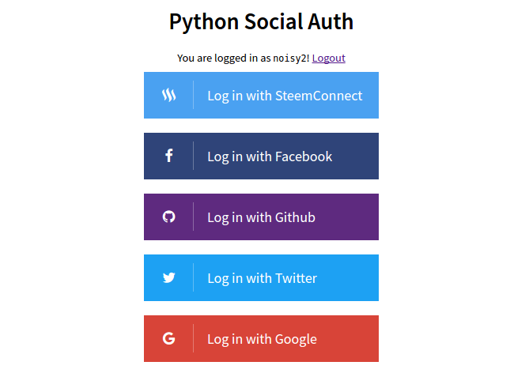

# Python Social Auth SteemConnect - Examples

Python Social Auth is an easy to setup social authentication/registration
mechanism with support for several frameworks and auth providers. 

## Description

  

Those examples shows how to use [python-social-auth-steemconnect provider](https://github.com/noisy/python-social-auth-steemconnect) with couple different python frameworks:

* [Django](https://www.djangoproject.com/)
* [Flask](http://flask.pocoo.org/)
* [Tornado](http://www.tornadoweb.org/en/stable/)

## Documentation

Project of Python Social Auth is available at http://python-social-auth.readthedocs.org/.

## License

This project follows the BSD license. See the [LICENSE](LICENSE) for details.
